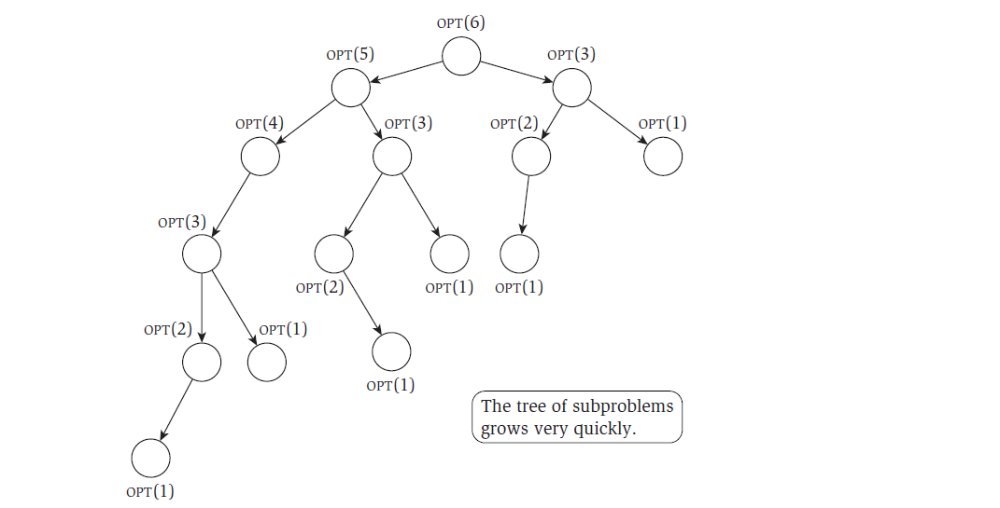

```{r setup, include=FALSE}
knitr::opts_chunk$set(echo = FALSE)
```

## Sequence Alignment

Sequence Aligment é um problema de comparação de strings que tem diversas aplicações

Este problema pode ser resolvido de forma eficiente com uso de programação dinâmica

Tópicos da apresentação:

* Programação Dinâmica
* Definição e aplicações do problema
* Algoritmo
* Análise do Algoritmo

## Programação dinâmica

A Programação Dinâmica se caracteriza pela resolução do problema com o uso de equações de recoorência. 

A equação de recorrência expressa uma solução ótima do problema principal em termos da solução ótima de subproblemas.

Exemplo de uma equação de recorrência:
  

$$ OPT(j) = max(v_j + OPT(f(j)), OPT(j-1)) $$


## Programação dinâmica


 


## Programação dinâmica

Para resolver o problema, é possível memorizar os resultados dos subproblemas, ou seja, é possível criar uma tabela com o resultado de cada subproblema. 

Se o número de problemas for polinomial e e o esforço exigido para calcular os subproblemas for polinomial, o tempo de execução é polinomial.


## Programação dinâmica

Propriedades da programação dinâmica:

* Há um número polinomial de subproblemas
* A solução para o problema original pode ser calculada a partir da solução de subproblemas
* Existe uma ordem natural dos subproblemas de menor para maior e uma forma fácil de calcular um problema a partir de subproblemas


## Sequence aligment - definição

O problema consiste em determinar o grau de proximidade entre sequências de símbolos.

Um exemplo é a proximidade entre duas palavras, como ocorrência e ocorência.


Isso pode ser usado na correção ortográfica de um texto. 

Se o usuário digitar uma palavra que não existe, qual a palavra existente que deve ser apresentada como alternativa? 

A que tem maior grau de proximidade.

Além de ser usado em dicionários e corretores de ortografia, o algoritmo pode ser usado para determinar o grau de similaridade do DNA de dois indivíduos, pois cada cromossomo pode ser modelado como uma sequência de símbolos no "alfabeto" {A, C, G, T}.

## Sequence aligment - definição

Há várias formas de alinhar uma sequência a outra de forma a calcular o grau de diferença entre elas.

É preciso definir como penalizar as diferenças.

Diferentes formas de penalização podem levar a diferentes alinhamentos

Exemplos: [Sequence Alignment](https://crotman.shinyapps.io/seqalign)

## Sequence aligment - algoritmo

Como foi visto é preciso definir penalidades para o alinhamento imperfeito das sequências X e Y. Cada tipo de incompatibilidade entre caracteres da mesma posição deve ser penalizado:

* Há uma penalidade para o gap, ou seja, para uma posição onde é usada uma letra de X e não é usada uma letra de Y, ou seja, onde há um gap. Chamemos de $\delta$.

* Há uma penalidade para posições onde as letras são diferentes. Pode haver penalidades diferentes de acordo com o tipo de diferença (fonética etc.). Chamemos de $\alpha_{x_i, y_j}$, onde $\alpha_{p,p} = 0$

* A diferença total entre as sequências é a soma dos custos de gap e de letras diferentes

## Sequence aligment - algoritmo

A ideia é calcular iterativamente as penalidades a usando uma regra de recorrência.

Sejam X e Y as sequências a alinhar e M o alinhamento de pares de elementos (i,j)

Sejam m e n o m-ésimo elemento da sequência X e n-ésimo elemento da sequência Y

Para montar a regra de recorrência, é útil perceber que, em um alinhamento ótimo uma das três setenças é verdadeira:

1. $(m,n) \in M$
2. o m-ésimo elemento de X não está casado com ninguém
3. o n-ésimo elemenro de Y não está casado com ninguém


## Sequence aligment - algoritmo

A regra de recorrência, portanto, fica assim:

$OPT(i,j) = min(\alpha_{x_i,y_j} + OPT(i - 1, j - 1), \delta + OPT(i - 1, j), \delta + OPT(i, j-1) )$

A tabela de subproblemas tem tamanho O(nm) e pode ser criada com o uso desta regra de recorrência.

O alinhamento M pode ser criado a partir da tabela, seguindo os passos de trás pra frente.

[Sequence Alignment](https://crotman.shinyapps.io/seqalign)


## Sequence aligment - análise do algoritmo


A corretude do algoritmo sai da própria equação de recorrência

A complexidade é a complexidade do cálculo da tabela de O(nm) elementos. Cada passo desse cálculo, usando a equação de recorrência, é feita em tempo constante.


